# Neusoft-Spitfire-E-Commerce-Platform 
> Neusoft practical training project "Cross-border e-commerce retail platform".
> Now the whole project is open source.

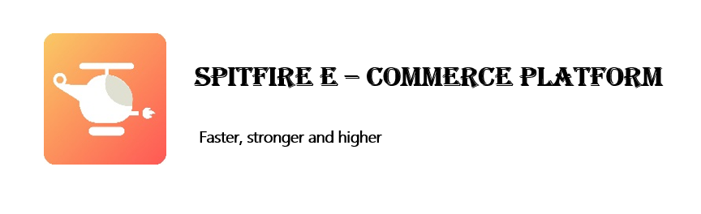

## Demo
- [Spitfire web system](http://39.98.124.34/)
- WeChat module is not online now.

## Introduction
Spitfire E-Commerce platform is cross-platform borrow and sell system. Users can access the system via both website and Wechat mini program.

## Project Structure
#### Function Modules
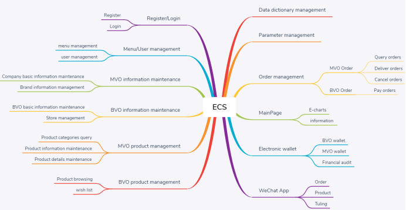

#### Business Flow Chart
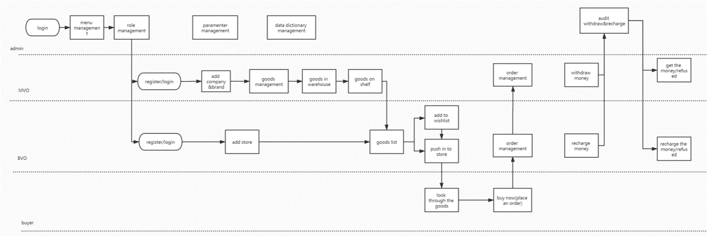

#### Frontend Architecture
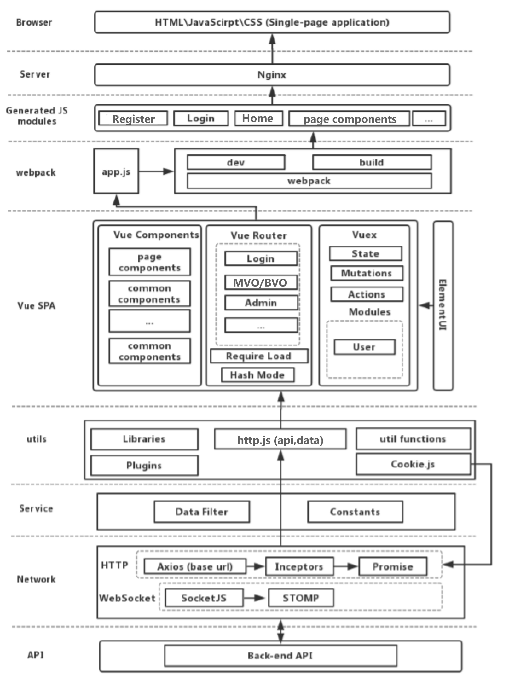{:height="100px" width="400px"}

#### Backend Architecture
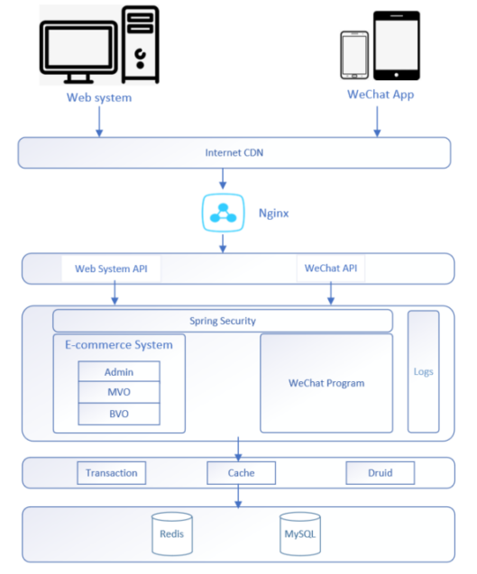

## Technique Stack

#### Backend
|Technique|Description|
|-----|-----|
|Spring boot|Container, basic MVC framework|
|Spring Security|Certification and authorization framework|
|JWT|JSON Web Token, compact URL-safe means|
|Swagger-UI|Documentation generation tool|
|Log4j|Log record tool|
|Junit|Unit test framework|
|Coverage|Unit test coverage statistics tool|
|Http Post|Blackbox test|
|Nginx|Web proxy server|

#### Database
|Technique|Description|
|-----|-----|
|MySQL|Database|
|MyBatis|First class persistence framework|
|MyBatisGenerator|Code generator for MyBatis|
|PageHelper|MyBatis pagination plugin|
|Druid|Database connection pool|
|Redis|Cache management|

#### Frontend
|Technique|Description|
|-----|-----|
|Vue.js|Popular frontend framework|
|Element-ui|Popular frontend framework|

## Project Display
#### Login

#### Register

#### Main Page
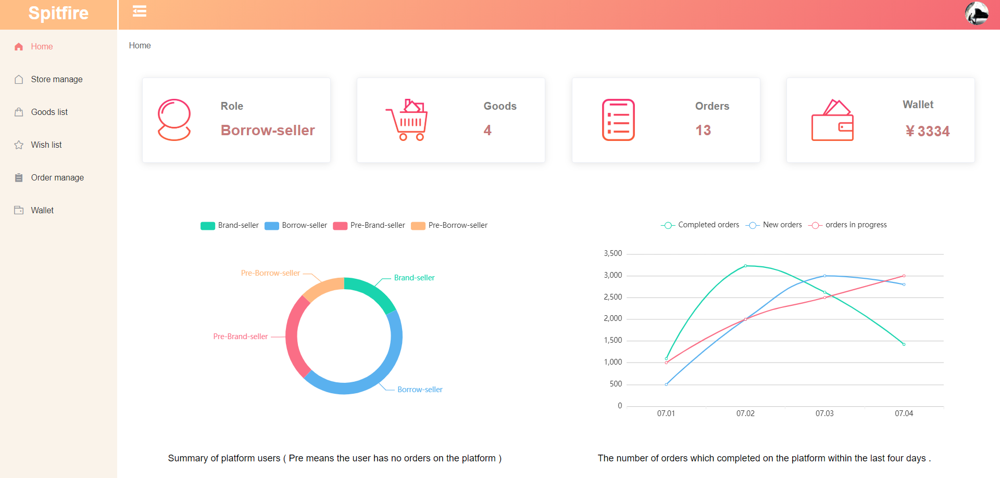

#### Wallet
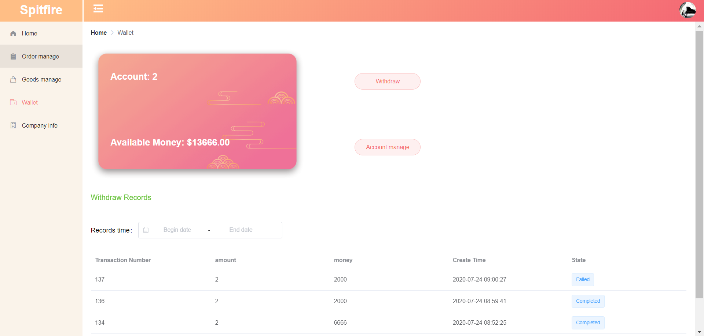

#### Order Management
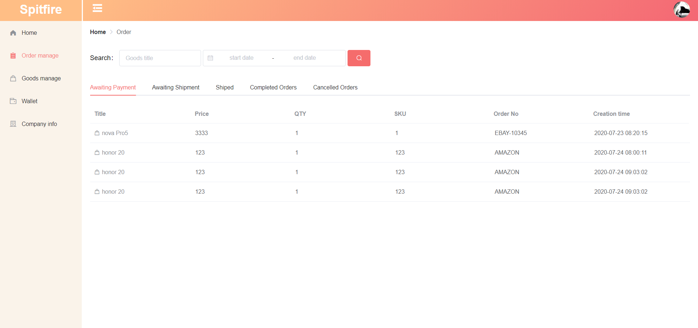

#### Brand-Seller Goods Management
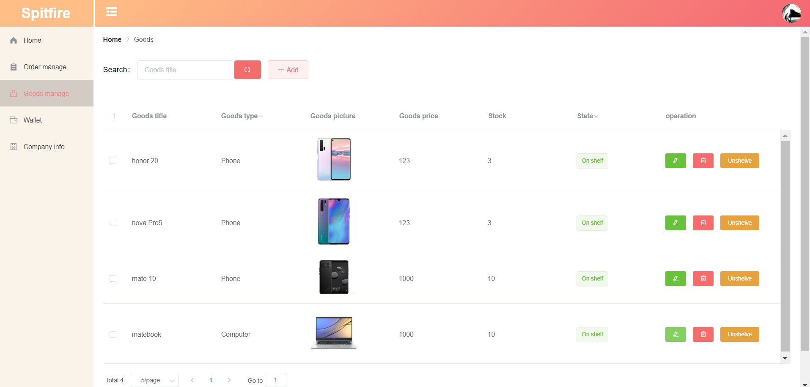

#### Brand-Seller Company Management
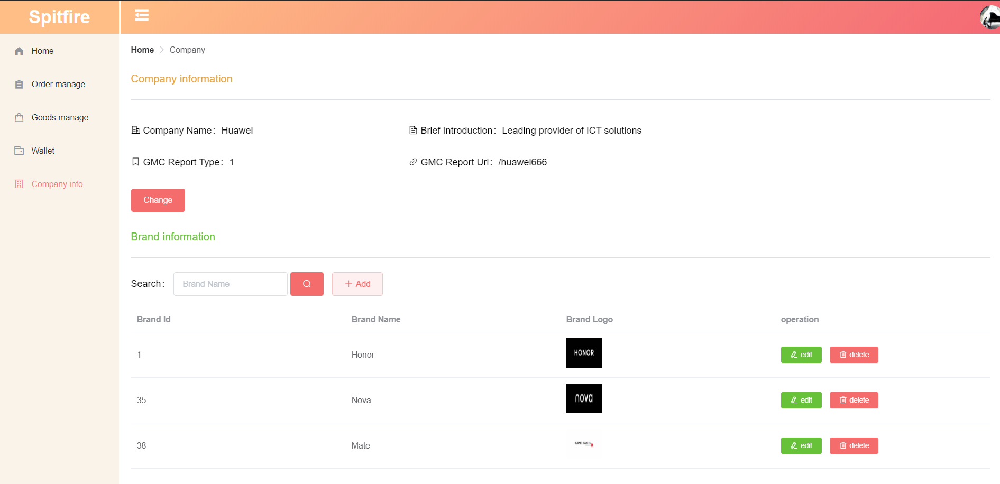

#### Borrow-Seller Goods Management
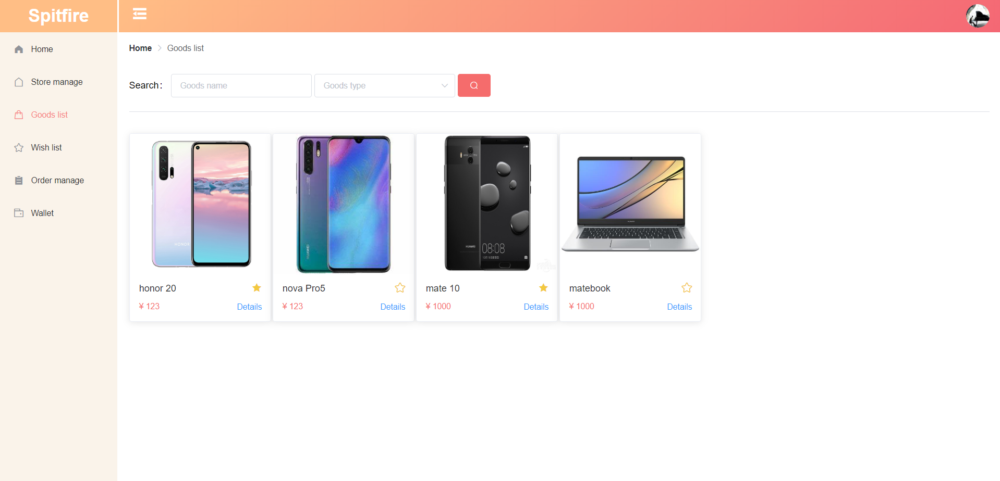

#### Borrow-Seller Wishlist Management
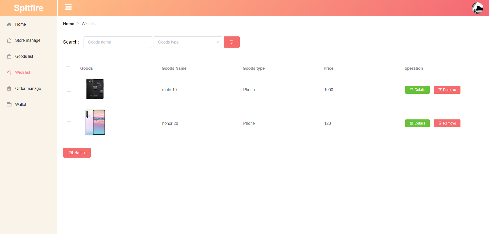

#### Borrow-Seller Store Management

#### Admin Menu Management
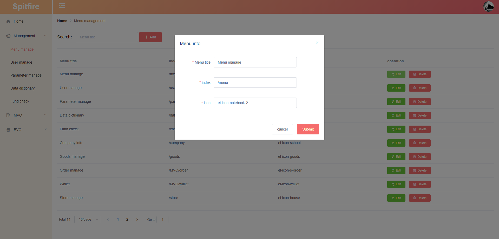

#### Admin User Management
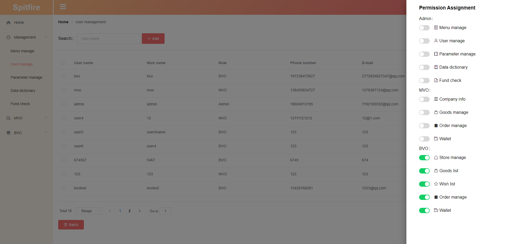

#### Admin Parameter Management
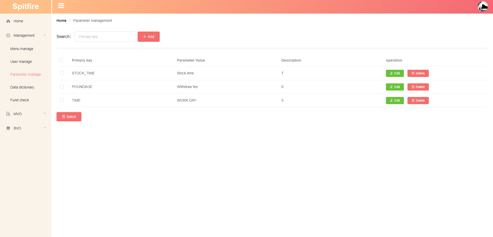

#### Admin Dictionary Management
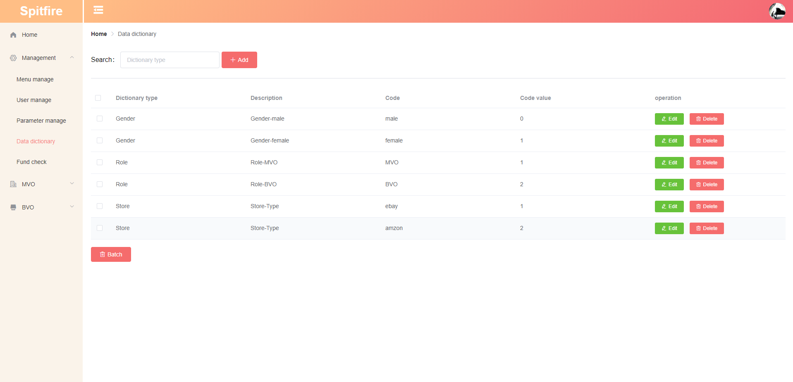

#### Admin Fund Audit Management
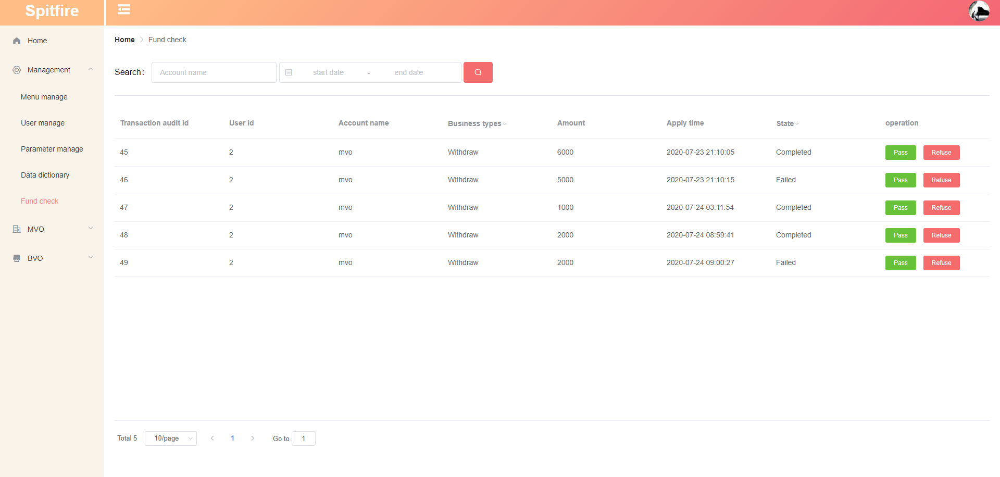